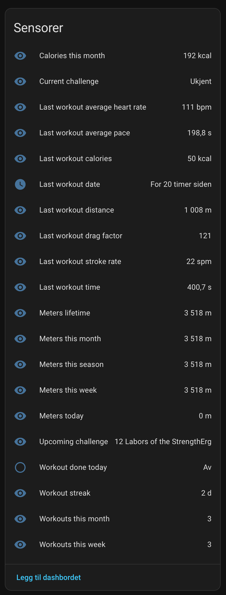

  

# Concept2 Logbook — Home Assistant Integration

Connects your [Concept2 Logbook](https://log.concept2.com) account to Home Assistant
over the official Concept2 API, and exposes your workout results as sensors and an
automation event. Read-only — it never writes anything back to your Concept2 account.

> [!NOTE]
> **AI-written, v1.0.0, two known gaps. Read this before installing.**
> This integration was built end-to-end by [Claude Code](https://claude.com/claude-code)
> (an AI coding agent) under human supervision — every line was reviewed. It's
> unit-tested (100% line coverage, CI green — see badges above) and confirmed
> working live against a real Home Assistant instance and a real Concept2
> account: the personal access token config flow, a full history sync, real
> sensor/challenge data, and - the one thing nothing else could substitute
> for - `concept2_new_result` firing correctly on a genuinely new workout,
> with the correct payload.
>
> **Two things are honestly still unconfirmed**, not silently skipped: a
> [starter dashboard](docs/example-dashboard.yaml) exists but hasn't been
> confirmed rendering without errors on a live instance yet (cosmetic risk
> only - the sensor values themselves are confirmed correct), and
> reauthentication after revoking your Concept2 token live has only been
> unit-tested, not tried for real. See the design doc's §6.3 for the full
> acceptance-test status. [Open an issue](../../issues) if either breaks for
> you.

## What this is

- **Polls** the Concept2 API every 15 minutes by default (configurable, 10 minutes
  minimum - see [Options](#options)) for your logged results (RowErg, SkiErg,
  BikeErg — anything Concept2 tracks), and exposes them as Home Assistant sensors:
  last workout details, computed totals (today/week/month/season/lifetime), a
  workout streak, and current/upcoming Concept2 challenges. This is a regular
  `GET` request on a timer, not a push/webhook from Concept2 - so after a workout,
  expect up to ~15 minutes before it shows up (or trigger it immediately yourself:
  **Settings → Devices & Services → Concept2 Logbook → ⋮ → Reload**).
- Fires a `concept2_new_result` event when a genuinely new result appears, so you can
  trigger automations (e.g. a TTS announcement, a light scene) on a new row.
- Optional one-time full history sync on setup, for accurate lifetime totals from day
  one instead of growing from install date.

## Sensors

**Last workout:** distance, time, average pace, average heart rate, stroke rate,
calories, drag factor, date.

**Totals:** meters today / this week / this month / this season / lifetime, workouts
this week / this month, calories this month, workout streak.

**Status:** a "workout done today" binary sensor.

**Challenges:** current challenge, upcoming challenge (public Concept2 data, no
token needed). Current challenge correctly shows "unknown" rather than an error when
Concept2 has no active challenge running right now.

**Diagnostic:** a "Last synced" timestamp sensor, and a "Sync now" button that
requests an immediate sync without reloading the whole integration.

Full technical detail in the design doc (`concept2-ha-integration-design.md`) §3.1 F3.

## Options

**Settings → Devices & Services → Concept2 Logbook → Configure** lets you change the
polling interval (minimum 10 minutes, to stay a good citizen of Concept2's API).

## Screenshots

The integration's entity list on a real Home Assistant instance and real Concept2
account, unedited (UI language is Norwegian - the stakeholder's own instance). Real
numbers pulled from an actual history sync: `1 008 m` last workout, `3 518 m`
lifetime/season/month/week so far, a 2-day workout streak, 3 workouts this week. Note
"Current challenge" correctly shows `Ukjent` ("Unknown") rather than an error - that's
the expected state when Concept2 has no active challenge running right now, not a
bug.

## Dashboard

[`docs/example-dashboard.yaml`](docs/example-dashboard.yaml) is a starter Lovelace
dashboard built entirely from stock Home Assistant card types (no extra HACS
frontend cards required) - totals, last workout, challenges, and the sync
controls. Deliberately doesn't mimic the PM5's live monitor layout, since this
integration polls every 15 minutes rather than streaming live data; the card
says so at the top rather than implying it's a live feed. Paste it via any
dashboard's **⋮ → Edit Dashboard → ⋮ → Raw configuration editor**.

**Honesty note:** this file exists and is believed correct, but hasn't yet been
confirmed rendering without errors on a live instance - see
[Known v1 limitations](#known-v1-limitations).

## What this is *not*

- **Not live telemetry.** It reads results after they sync to the Concept2 Logbook —
  it does not talk to your PM5 over Bluetooth while you're rowing. If you want
  live stroke-by-stroke data on the wall while rowing, this isn't that; look at the
  existing PM5 Bluetooth integrations instead.
- **Not able to write anything.** No scopes, no code path, can create/edit/delete
  nothing in your Concept2 account.

## Requirements

- A Concept2 Logbook account.
- Your **own** personal access token, generated in a few clicks at
  **log.concept2.com → Profile → Edit Profile → Applications → Concept2 Logbook API**.
  No app registration, no client ID/secret, no redirect URI to configure — it's a
  single token string. It stays valid until you revoke it on that same page. (This
  integration is strictly read-only; per Concept2's own docs, personal-use apps that
  only read data are meant to use this token rather than register a full OAuth
  client, which is the path for apps distributed to multiple users.)
- [HACS](https://hacs.xyz) installed (recommended), or willingness to copy files in
  manually.

## Installation

### Not in the HACS default store yet

This repository isn't submitted to the HACS default store, so it won't show up in a
plain HACS search — you add it as a **custom repository** (steps below). See
[Known v1 limitations](#known-v1-limitations).

### Via HACS (recommended)

1. In Home Assistant, go to **HACS**.
2. Click the **⋮** (three dots) in the top right → **Custom repositories**.
3. Add this repository's URL, category **Integration**:
   `https://github.com/kennethnilssen/hacs-concept2-logbook`
4. Find **Concept2 Logbook** in HACS and click **Download**.
5. Restart Home Assistant.
6. Go to **Settings → Devices & Services → Add Integration**, search for
   **Concept2 Logbook**.
7. Generate a personal access token at
   **log.concept2.com → Profile → Edit Profile → Applications → Concept2 Logbook API**
   (see [Requirements](#requirements) above), then paste it into the setup form.
8. You'll be asked whether to sync your full workout history now (accurate lifetime
   totals immediately, but slower on first setup) or start fresh from today (totals
   grow over time instead).

### Revoking access

Go back to **log.concept2.com → Profile → Edit Profile → Applications** and revoke
the token there at any time. Home Assistant will detect this on its next poll and
prompt you to reauthenticate (paste a new token) rather than fail silently.

### Manual (without HACS)

1. Copy `custom_components/concept2_logbook` from this repo into your Home
   Assistant config's `custom_components/` folder.
2. Restart Home Assistant.
3. Continue from step 6 above.

## Known v1 limitations

- **Two acceptance tests are still open, honestly** (see the warning at the top and
  the design doc's §6.3): a [starter dashboard](docs/example-dashboard.yaml) exists
  now, but hasn't been confirmed rendering without errors on a live instance yet
  (cosmetic risk only), and reauthentication after revoking your Concept2 token has
  only been unit-tested, not tried live.
- Deleting a workout on Concept2's side isn't detected instantly — it's caught on a
  periodic reconciliation (up to ~24h later), since Concept2's polling API has no
  "deleted items" feed (only its webhook does, which is out of scope for v1).
- Workout dates are assumed to be in Home Assistant's local timezone (Concept2's API
  doesn't reliably return one).
- Not yet submitted to the HACS default store — install as a custom repository (above).
- The integration icon (`custom_components/concept2_logbook/brand/icon.png`) is a
  plain placeholder, not a designed logo — nobody's done branding work on this yet.

## Security

- Personal access token authentication (D5) — you generate your own token at your
  Concept2 profile and can revoke it at any time from that same page.
- Read-only: no write scopes requested, no code path capable of writing to Concept2.
  Talks to the production Concept2 API directly — per Concept2's own docs, read-only
  personal-use apps aren't required to develop against a separate dev server.
- No credentials are ever stored in this repository or logged.
- **One honest limitation:** unlike a full OAuth2 client registration, this
  integration cannot see or restrict what scope your personal token actually carries
  — that's set by Concept2's own page when you generate it, not by this integration's
  code. See [SECURITY.md](SECURITY.md) for the full threat model and OWASP alignment.

## Attribution

Built with [Claude Code](https://claude.com/claude-code), human-reviewed,
security-focused — see [CLAUDE.md](CLAUDE.md) for the working agreement this project
was built under, and [concept2-ha-integration-design.md](concept2-ha-integration-design.md)
for the full design, scope, and test plan. See [CHANGELOG.md](CHANGELOG.md) for
what's actually been built so far.

## License

MIT — see [LICENSE](LICENSE).
